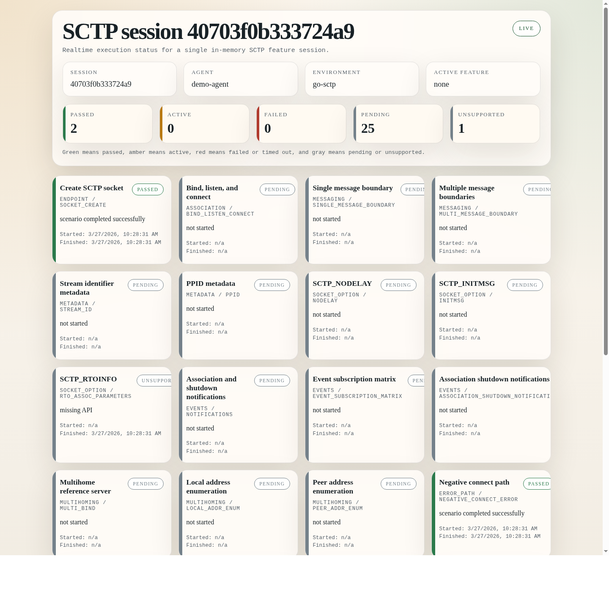

# SCTP Conformance Suite

`sctp-conformance` is a FreeBSD reference-backed SCTP conformance project.
It exposes a browser dashboard plus an HTTP/JSON control plane so coding
agents can build SCTP clients in real language runtimes and have their
behavior scored against the reference implementation.

## Dashboard

The single-session dashboard is the main operator view while an agent is
attempting scenarios.



Each feature card links to the relevant RFC section or sections defining the
behavior under test.

## How It Works

The primary interface is a FreeBSD-resident SCTP feature server.

The server exposes:

- an HTTP/JSON control plane for feature discovery, session management, and result reporting
- a built-in browser dashboard for live per-session traffic-light status
- an SCTP data plane where the actual transport scenarios execute

The intended workflow is:

1. Run `sctp-feature-server` on a FreeBSD host.
2. Give a coding agent the server URL, the feature catalog, and one of the client repositories in `clients/`.
3. Let the agent build a client that attempts each feature in turn.
4. The server marks features `passed` or `failed` from observed SCTP behavior, and the agent can declare a feature `unsupported` with evidence.

## LLM-Built Clients

This repository is designed for LLM-assisted client development.

- `clients/go-sctp` is the Go runtime fork used for Go client work.
- `clients/rust-sctp` is the Rust runtime fork used for Rust client work.
- An agent such as Codex CLI is pointed at one of those submodules plus the feature-server URL.
- The agent edits and builds the client in the submodule checkout, then drives scenarios against the FreeBSD server.
- When a feature cannot be implemented in the current runtime API, the agent reports it as `unsupported` with concrete evidence instead of guessing.

The current published Go client is in `clients/go-sctp/misc/sctp-feature-client/go`.

If you want a concrete operator guide for prompting a coding agent, see
[docs/instruct-coding-agent.md](docs/instruct-coding-agent.md).

## Clone And Bootstrap

Clone with submodules:

```sh
git clone --recurse-submodules git@github.com:3vilM33pl3/sctp-conformance.git
cd sctp-conformance
```

If you cloned without submodules:

```sh
git submodule update --init --recursive
```

Bootstrap the Go toolchain inside the Go client submodule before trying the Go feature client:

```sh
cd clients/go-sctp/src
./make.bash
cd ../../..
```

After that, the Go feature client can be built from the submodule root:

```sh
cd clients/go-sctp
GOROOT=$(pwd) ./bin/go build ./misc/sctp-feature-client/go
```

The client can request either the default native SCTP server profile or the
new UDP-encapsulation profile. The default remains native:

```sh
cd clients/go-sctp
GOROOT=$(pwd) ./bin/go run ./misc/sctp-feature-client/go \
  --base-url http://free.metatao.net:18080
```

To request the RFC 6951 UDP-encapsulation profile explicitly:

```sh
cd clients/go-sctp
GOROOT=$(pwd) ./bin/go run ./misc/sctp-feature-client/go \
  --base-url http://free.metatao.net:18080 \
  --transport-profile udp_encap
```

To build a FreeBSD client binary from the same checkout:

```sh
cd clients/go-sctp
GO111MODULE=off GOROOT=$(pwd) GOOS=freebsd GOARCH=amd64 CGO_ENABLED=0 \
  ./bin/go build -o /tmp/go-sctp-feature-client-freebsd ./misc/sctp-feature-client/go
```

That binary can then be copied to a FreeBSD 15 host and pointed at the
reference server:

```sh
/tmp/go-sctp-feature-client-freebsd --base-url http://free.metatao.net:18080
```

The Rust feature client is built against the in-tree `std::net` SCTP API in
`clients/rust-sctp`. In the published fork, the simplest reproducible setup is
to disable CI LLVM downloads and let `x.py` build LLVM from the pinned
`src/llvm-project` submodule. The commands below assume the current Linux host
triple is `x86_64-unknown-linux-gnu`:

```sh
cd clients/rust-sctp
cat > bootstrap.toml <<'EOF'
change-id = "ignore"
profile = "library"
[llvm]
download-ci-llvm = false
EOF
python3 x.py build library/std --stage 1
python3 x.py build library/proc_macro --stage 1
RUSTC="$(pwd)/build/x86_64-unknown-linux-gnu/stage1/bin/rustc" \
RUSTFLAGS="--sysroot=$(pwd)/build/x86_64-unknown-linux-gnu/stage1" \
cargo run --manifest-path src/tools/sctp-feature-client/Cargo.toml -- --list-scenarios
```

The first Rust build is heavy because it compiles LLVM locally and expects
`cmake`, `ninja`, `clang`, and `c++` to be available on the Linux host. The
extra `library/proc_macro` build is required because the feature client uses
`serde_derive` and therefore needs a complete stage1 proc-macro toolchain, not
just `library/std`.

To drive the FreeBSD conformance server from the Rust client:

```sh
cd clients/rust-sctp
RUSTC="$(pwd)/build/x86_64-unknown-linux-gnu/stage1/bin/rustc" \
RUSTFLAGS="--sysroot=$(pwd)/build/x86_64-unknown-linux-gnu/stage1" \
cargo run --manifest-path src/tools/sctp-feature-client/Cargo.toml -- \
  --base-url http://free.metatao.net:18080
```

Manual-setup Rust scenarios stay skipped by default and only run with
`--include-manual-setup` or an explicit `--features` list.

## FreeBSD Server

Build on the FreeBSD host with base tools:

```sh
cd server/freebsd_ref
make
```

Run the server:

```sh
./sctp-feature-server \
  --http-host 0.0.0.0 \
  --http-port 18080 \
  --sctp-addrs 10.22.6.90,127.0.0.2 \
  --advertise-addrs 10.22.6.90,127.0.0.2
```

- `--sctp-addrs` are the local FreeBSD addresses the server binds.
- `--advertise-addrs` are the addresses returned in feature contracts.
- One active feature is allowed per session.
- All state is in memory only.
- `POST /v1/sessions` accepts `transport_profile` with `native` or `udp_encap`.

## Manual Prerequisites

The server never performs root actions.

If SCTP is not loaded or a required local address is missing, the server or feature activation fails with the exact command to run manually.

Current prerequisites on the FreeBSD host:

```sh
kldload /boot/kernel/sctp.ko
ifconfig lo0 alias 127.0.0.2/8
```

If you want remote multihoming scenarios to use non-loopback addresses, add those addresses to a real interface manually and start the server with matching `--sctp-addrs` and `--advertise-addrs`.

## Agent Flow

The control plane is documented in [docs/agent-http-api.md](docs/agent-http-api.md).

Minimal flow:

```text
GET  /
GET  /v1/features
POST /v1/sessions
GET  /sessions/{sessionId}/dashboard
POST /v1/sessions/{sessionId}/features/{featureId}/start
GET  /v1/sessions/{sessionId}/features/{featureId}
GET  /v1/sessions/{sessionId}/summary/stream
POST /v1/sessions/{sessionId}/features/{featureId}/complete
POST /v1/sessions/{sessionId}/features/{featureId}/unsupported
GET  /v1/sessions/{sessionId}/summary
```

`GET /` serves a live session index page with links to every in-memory session dashboard.

`POST /v1/sessions` returns a `dashboard_path` for the live session board. The dashboard uses the summary snapshot and the summary SSE stream to show pending, active, passed, failed, timed-out, and unsupported feature states in realtime.
Per-feature cards also show RFC links sourced from the server-side feature catalog.

## Contract Lifecycle

Each feature run is driven by a server-issued scenario contract.

1. The client reads the catalog from `GET /v1/features`.
2. The client creates a session with `POST /v1/sessions`.
3. For one feature, the client calls `POST /v1/sessions/{sessionId}/features/{featureId}/start`.
4. The `start` response includes the per-feature `contract`.
5. The client uses that contract to decide:
   - which SCTP address or addresses to dial
   - which socket options or subscriptions to enable
   - which messages to send in `client_send_messages`
   - whether it should expect server-sent messages
6. The server scores the SCTP behavior it observes, and the client submits `complete` or `unsupported` only when the feature's `completion_mode` requires it.

The important boundary is that the FreeBSD server owns the contract contents. Client implementations consume the contract; they do not invent feature-specific payloads or addresses locally.

The current server catalog covers:

- socket creation
- basic association setup
- single and multi-message boundaries
- stream ID and PPID metadata
- `SCTP_NODELAY`
- `SCTP_INITMSG`
- `SCTP_RTOINFO`
- `SCTP_DELAYED_SACK`
- `SCTP_MAX_BURST`
- notifications
- event subscription coverage and shutdown notifications
- peer-address-change notifications with explicit manual path-state setup
- multihome bind/connect and address enumeration
- `SCTP_BINDX` add/remove
- primary-address management requests
- negative connect error handling
- `SCTP_DEFAULT_SNDINFO` and server-side receive metadata checks
- large-message reassembly and `SCTP_MAXSEG` fragmentation checks
- partial-delivery notifications with explicit manual receive-buffer tuning
- `SCTP_RECVNXTINFO`
- unordered delivery attempts
- `SCTP_AUTOCLOSE`
- association peeloff and association ID enumeration
- association status introspection
- stream reconfiguration reset and add-stream attempts

## Layout

- `server/freebsd_ref/`: FreeBSD C++ reference server
- `clients/go-sctp/`: Go runtime fork used for Go client generation
- `clients/rust-sctp/`: Rust runtime fork used for Rust client generation
- `docs/agent-http-api.md`: HTTP control plane used by coding agents
- `docs/instruct-coding-agent.md`: operator guide for prompting a coding agent to build a client
- `docs/images/dashboard-demo.png`: README dashboard screenshot
- `scripts/smoke_feature_server.py`: acceptance smoke test for the server API and SCTP data plane
- `adapters/freebsd_c/`: FreeBSD C helper used for smoke testing and baseline validation

## Smoke Test

After building the FreeBSD helper on the FreeBSD host:

```sh
cd adapters/freebsd_c
make
```

Run the smoke test from the local machine:

```sh
python3 scripts/smoke_feature_server.py \
  --base-url http://free.metatao.net:18080 \
  --ssh-host free.metatao.net \
  --helper-path /tmp/sctp-freebsd-helper/sctp-freebsd-helper
```

The smoke test exercises:

- one `server_observed` feature
- one `hybrid` feature
- one `agent_reported` feature
- dashboard discovery and the live summary stream

## Licensing

`sctp-conformance` itself is licensed under the BSD 2-Clause License. See [LICENSE](LICENSE).

That top-level license does not replace or override the licenses of the client submodules under `clients/`. Those are separate repositories with their own license terms:

- `clients/go-sctp`: see `clients/go-sctp/LICENSE`
- `clients/rust-sctp`: see `clients/rust-sctp/LICENSE-APACHE`, `clients/rust-sctp/LICENSE-MIT`, and the `clients/rust-sctp/LICENSES/` directory
